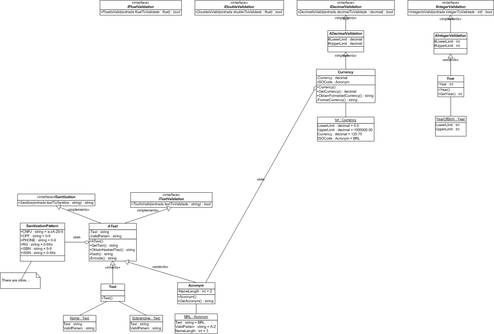

# OOPFoundation

## Structures

### Abstract Classes
`ADecimalValidation` *implements* `IDecimalValidation` : defines the `DecimalIsValid()` method

`AIntegerValidation` *implements* `IIntegerValidation` : defines the `IntegerIsValid()` method

`AText` *implements* `ISanitization`, `ITextValidation` : defines both `Sanitize()` and `TextIsValid()` methods

### Interfaces
`IDecimalValidation`

`IDoubleValidation`

`IFloatValidation`

`IIntegerValidation`

`ISanitization`

`ITextValidation`

### Classes
`Currency` *extends* `ADecimalValidation`: it is used to create a currency object to represent a real world currency e.g. **BRL** as for **Brazilian Reais** or **GBP** as for **Great Britain Pound**, validating and retaining its value

`SanitizationPattern` : it is used to **standardize** different and more common sanitization patterns like CPF="0-9" (only digits are valid)

`Text` *inherist* `AText` : it is used to create text objects to **validate** and **sanitize** its value

`Year` *extends* `AIntegerValidation` : it is used to create **year** objects and **validate** its value, e.g. **YearOfBirth**

## UML

---
## NOTICE! 

This is a **NuGet** package aimed at teaching Object-Oriented Paradigm **concepts** to a specific group of students. 

Best regards,

Prof. Marcos M. Chaves

CST | TADS